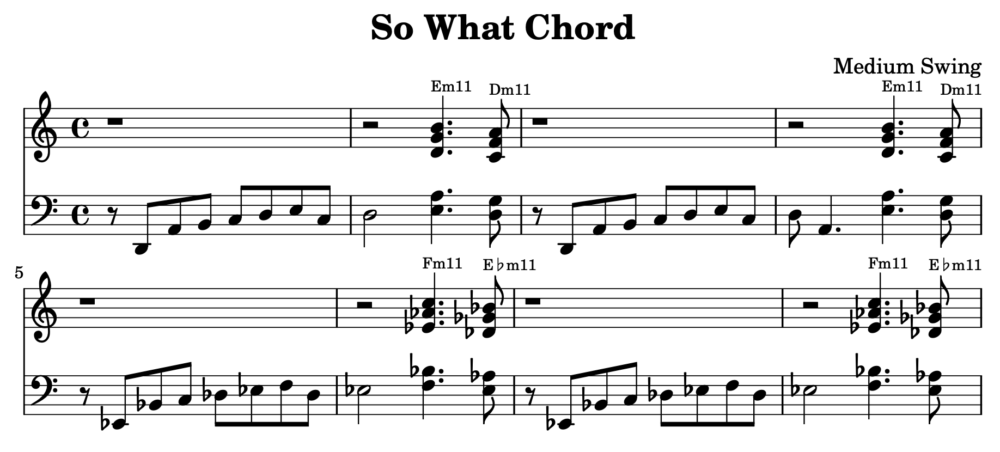

music-notes
===============================================================================

This repo is for my music theory notes.

Typesetting
-------------------------------------------------------------------------------

This project is an example of how to typeset music in markdown/abc and
compile it to pdf via pandoc/latex/lilypond.

See `example/`. You edit a top markdown file: `example.md` and the included
abc music files: `tune*.abc`.

Calling `make` builds: markdown → lytex → tex → pdf.

Links
-------------------------------------------------------------------------------

Theory:

-   [17 Most Common Pop Chord Progressions](https://www.guitarlobby.com/pop-chord-progressions/)
-   [So What Chord](https://www.thejazzpianosite.com/jazz-piano-lessons/jazz-chord-voicings/so-what-chord/)

Typesetting:

-   [abcnotation.com](https://abcnotation.com/)
-   [lilypond.org](https://lilypond.org/)

Author
-------------------------------------------------------------------------------

Ryan Reece ([@rreece](https://github.com/rreece))
Created: December 30, 2025

